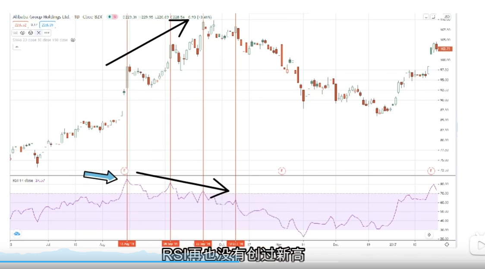
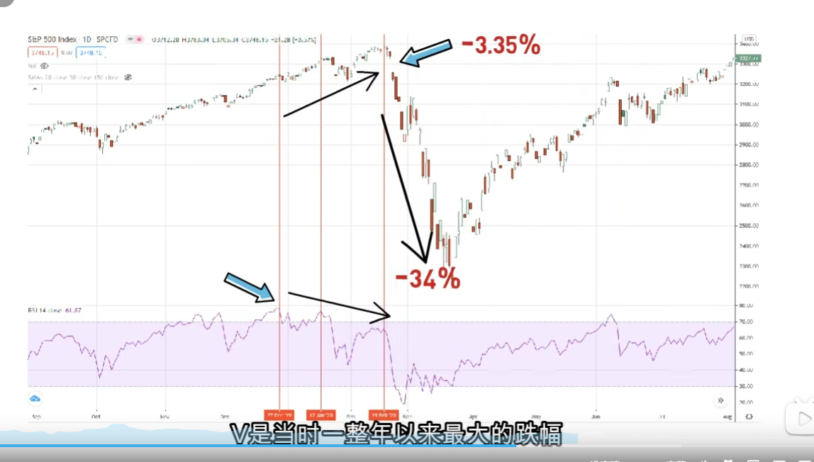
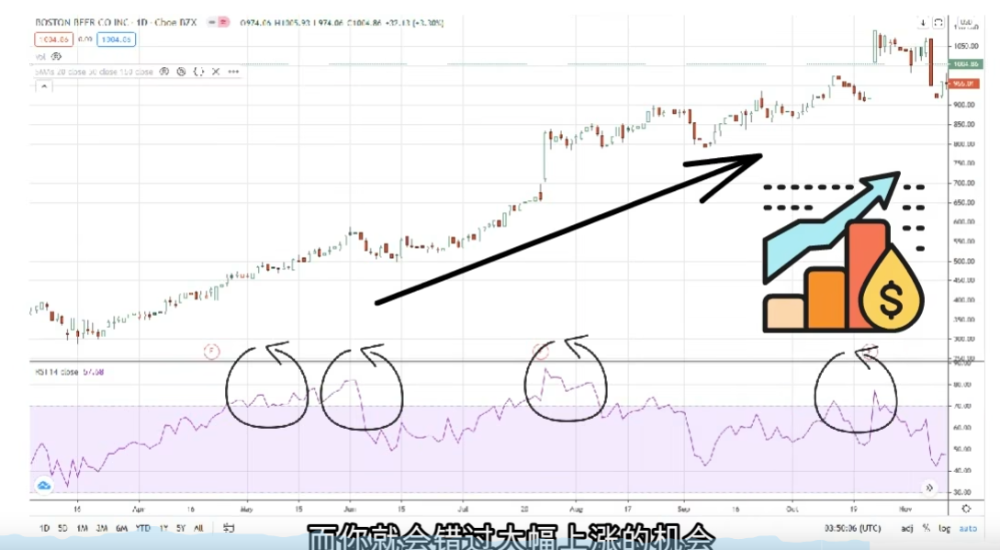
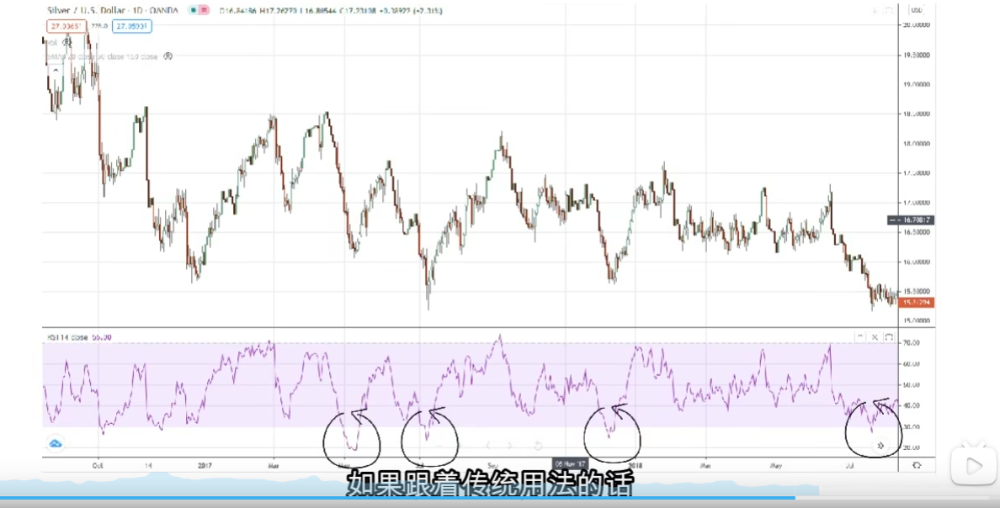

比如在六天内，如果有四天都是上涨，有两天是下跌，上涨和下跌分别除以六天。然后六天平均涨幅除以六天的平均涨跌幅

上涨：2 + 2 + 2 + 3 = 9 / 6 = 1.5
下跌：2 + 1 = 3 / 6 = 0.5
6天平均涨跌幅：9 + 3 = 12 / 6 = 2
rsi = 1.5 / (1.5 + 0.5) * 100 = 75RSI

RSI是在0~100的范围内运行，越接近0值表示卖方力量越强，市场上大量抛出股票，相反RSI越接近100，表示买方力量越强，市场上大量买入股票

如果我们能够正确使用RSI指标，就能抓紧市场反转时机，在趋势大涨之前提早买入，又能从大跌的时候尽早离场，如果RSI超过70，属于超买区，反映着买方力量比卖方强，传统用法就是抛售股票，相反如果跌破30，就是属于超卖区，反应这卖方力量比买方强，传统用法就是抄底买入。

市场上有的人会设定超买区为80，超卖区为20，这并没有任何对错，只是每个分析师使用方式不一样，这完全可以由你来决定。

RSI除了超买区和超卖区，还有一个很好用的指标，那就是背离，简单来说就是与股价相反走势。RSI有顶背离和底背离，顶背离是指当市值价格不断创新高，而RSI并没有再创新高，反而上升的动力开始放缓，反映这买方的力量开始减弱。相反底背离是指资产价格不断创新低，而RSI并没有在创新低，反应这卖方的力量开始减弱，如果背离的时间越长，引来反弹的力度就越大，这时候应该多加留意，V型反弹或调整可能即将发生。

(需要找背离的例子)

说了那么多，这里我们举个例子，阿里巴巴在2017年8月12号的时候，RSI达到高峰的85点，但股价还在继续创新高，整整两个月的时间，RSI再也没有创过新高，反而上涨幅度不断萎缩，造成股票与RSI相反走势，直到11月10号开始，股价直线下滑。接下来的日子，股价与RSI双双快速下跌，跌幅超过整整20%。





(除了个股，RSI也能用在指数上，2020年2月份的时候，美股开始大跌，标普500从3400点直线大跌至2200点，跌幅超过整整34%，我们来看看当时RSI发生了什么情况，可以看到2019年11月27号的时候，标普500指数RSI最高峰时78点，接下来RSI开始缓慢下跌，而指数却不断创新高，直到2月20号的时候，整个股市快速崩盘，2月24号那天一开始直接跳空低开，全天大跌3.35%，是当时一整年以来最大的跌幅，过后整个3月内再出现十次垄断。如果当时你有注意到RSI与指数发生背离，恭喜你，你应该完美避开了这次的大跌，并且还可能找到V型反弹，因为在疯狂大跌的情况下，RSI再次发生背离情况，股票不断快速大跌，RSI却缓慢上涨)





RSI本身有两个主要的优点，第一它是大部分指标里反应最敏捷的其中之一，第二就是背离理论。但所有技术指标本身都有盲点，当单边趋势的时候，RSI用法一般都会失效，如果盲目跟从，甚至让你输得倾家荡产。

我们可以看到这张图，整个趋势是向上，价格不断创新高，但RSI都是出现超买区，显示买方力量已经过强，如果跟着传统用法的话，这时候应该卖出，而你就会错过大幅上涨的机会。相反在股价不断创新低，而RSI不断出现在超卖区，如果跟着传统用法的话，这时候应该买入，而随后而来的大跌将会等着你，随时走上一条不归路。







最后我们总结一下，虽然RSI在市场上是最火热的指标之一，但股市不能只靠一个技术指标就能够打天下，之前有说过，RSI本身也有最大的盲点，特别是运用在一些暴涨股，一直维持在超买区，如果跟着RSI指标选择抛售的话，你会损失一大截的获利机会。

我们需要注意一点，RSI并没有确认时机的能力，最好再配合其他技术指标确认趋势，再加上我们可以使用RSI背离作为提醒信号，在多次发生背离信号的时候需要额外注意，同时再加上其他技术分析指标，比如MACD，移动平均线等等，进一步加强策略布局的胜算。


代码说明

```c
/*
 * TA_RSI - Relative Strength Index (相对强弱指数)
 * 
 * 功能描述：
 * 计算相对强弱指数(RSI)，这是一个动量振荡器，用于衡量价格变化的速度和幅度。
 * RSI值范围在0-100之间，通常用于识别超买和超卖条件。
 * 
 * 算法基础：
 * 基于J. Welles Wilder的原始算法，使用Wilder平滑方法计算平均涨幅和平均跌幅
 * 
 * 市场应用：
 * - 6天：短期基准，适合短线交易
 * - 14天：中长期基准，最常用的默认值
 * - 21天：长期趋势分析
 * 
 * 参数说明：
 * @param startIdx        - 输入数据开始索引
 * @param endIdx          - 输入数据结束索引  
 * @param inReal[]        - 输入价格数组(通常是收盘价)
 * @param optInTimePeriod - 计算周期(2-100000，默认14)
 * @param outBegIdx       - 输出结果开始索引(输出参数)
 * @param outNBElement    - 输出结果元素数量(输出参数)
 * @param outReal[]       - 输出RSI值数组(输出参数)
 * 
 * 返回值：
 * @return TA_RetCode - 操作结果代码
 * 
 * RSI计算公式：
 * RSI = 100 * (平均涨幅 / (平均涨幅 + 平均跌幅))
 * 
 * 使用示例：
 * - RSI > 70: 通常表示超买，可能面临回调
 * - RSI < 30: 通常表示超卖，可能出现反弹
 * - RSI = 50: 中性区域
 * 
 * 简单平滑公式： 新平均 = (所有历史数据的总和) / 总天数
 * Wilder平滑公式： (旧平滑平均 × 13 + 新值) / optInTimePeriod
 * 
 */
TA_LIB_API TA_RetCode TA_RSI( int    startIdx,        /* 输入数据开始索引 */
                              int    endIdx,          /* 输入数据结束索引 */
                              const double inReal[],  /* 输入价格数组(通常是收盘价) */
                              int           optInTimePeriod, /* 计算周期(2-100000，默认14) */
                              int          *outBegIdx,       /* 输出结果开始索引(输出参数) */
                              int          *outNBElement,    /* 输出结果元素数量(输出参数) */
                              double        outReal[] )      /* 输出RSI值数组(输出参数) */
{
   /* 局部变量声明 */
   int outIdx;                    /* 输出数组索引 */

   int today,                     /* 当前处理的数据点索引 */
       lookbackTotal,             /* 回望期总数(计算RSI需要的历史数据量) */
       unstablePeriod,            /* 不稳定期(RSI值不稳定的初始期数) */
       i;                         /* 循环计数器 */
   double prevGain,               /* 前期的平均涨幅 */
          prevLoss,               /* 前期的平均跌幅 */
          prevValue,              /* 前一个价格值 */
          savePrevValue;          /* 保存的前一个价格值(用于Metastock兼容性) */
   double tempValue1,             /* 临时计算变量1 */
          tempValue2;             /* 临时计算变量2 */

   #if defined( USE_SINGLE_PRECISION_INPUT )
        ARRAY_MEMMOVEMIX_VAR;  /* 单精度输入时的内存移动变量声明 */
   #endif

   /* 初始化输出参数 */
   VALUE_HANDLE_DEREF_TO_ZERO(outBegIdx);     /* 输出开始索引初始化为0 */
   VALUE_HANDLE_DEREF_TO_ZERO(outNBElement);  /* 输出元素数量初始化为0 */

   /*
    * 计算回望期总数 - RSI需要的历史数据量
    * 回望期是指计算某个技术指标需要多少历史数据
    * 对于RSI来说，需要足够的历史数据来计算初始的平均涨幅和平均跌幅
    * 回望期通常比计算周期稍大，因为需要额外的数据来稳定指标值
    */
   lookbackTotal = LOOKBACK_CALL(RSI)( optInTimePeriod );

   /* 调整开始索引，确保有足够的历史数据计算RSI */
   if( startIdx < lookbackTotal )
      startIdx = lookbackTotal;

   /* 边界检查：确保有数据可处理 */
   if( startIdx > endIdx )
      return ENUM_VALUE(RetCode,TA_SUCCESS,Success);

   outIdx = 0; /* 输出数组索引，从0开始 */

   /* 特殊情况处理：当周期为1时，直接复制输入数据到输出 */
   /* 因为周期为1时无法计算RSI，所以直接返回原始价格数据 */
   if( optInTimePeriod == 1 )
   {
      VALUE_HANDLE_DEREF(outBegIdx) = startIdx;        /* 设置输出开始索引 */
      i = (endIdx-startIdx)+1;                         /* 计算输出元素数量 */
      VALUE_HANDLE_DEREF(outNBElement) = i;            /* 设置输出元素数量 */
      
      /* 直接复制输入数据到输出数组 */
      #if defined( USE_SINGLE_PRECISION_INPUT )
        ARRAY_MEMMOVEMIX( outReal, 0, inReal, startIdx, i );  /* 单精度输入 */
      #else
        ARRAY_MEMMOVE( outReal, 0, inReal, startIdx, i );     /* 双精度输入 */
      #endif
      return ENUM_VALUE(RetCode,TA_SUCCESS,Success);
   }

   /*
    * 开始RSI计算：累积Wilder的"平均涨幅"和"平均跌幅"
    * 在初始周期内计算基础的平均涨跌幅
    * startIdx：用户指定的开始计算索引（比如第100天）
    * lookbackTotal：计算RSI需要的历史数据量（比如14天）
    * 计算当前处理位置：从用户指定的开始计算索引减去计算RSI需要的历史数据量
    * 得到当前处理位置：第100天 - 14天 = 第86天, 目的确保有足够的历史数据来计算RSI
    */
   today = startIdx-lookbackTotal;  /* 设置当前处理位置为回望期开始 */
   prevValue = inReal[today];       /* 获取第一个价格值作为基准 */

   /* 获取RSI的不稳定期设置 */
   unstablePeriod = TA_GLOBALS_UNSTABLE_PERIOD(TA_FUNC_UNST_RSI,Rsi);

   /* Metastock兼容性处理 */
   /* 如果没有不稳定期，需要计算Metastock特有的初始价格条 */
   /* 如果存在不稳定期，则无需计算，因为第一个值会被跳过 */
   if( (unstablePeriod == 0) &&
       (TA_GLOBALS_COMPATIBILITY == ENUM_VALUE(Compatibility,TA_COMPATIBILITY_METASTOCK,Metastock)))
   {
      /* 保存prevValue，因为它可能被输出覆盖 */
      /* (因为输出指针可能与输入指针相同) */
      savePrevValue = prevValue;

      /* Metastock特有的计算方式 */
      /* Metastock重新使用第一个价格条，所以初始时没有涨跌幅 */
      /* (不知道为什么他们要这样做) */
      prevGain = 0.0;  /* 初始化平均涨幅为0 */
      prevLoss = 0.0;  /* 初始化平均跌幅为0 */
      
      /* 计算初始周期内的涨跌幅累积 */
      for( i=optInTimePeriod; i > 0; i-- )
      {
         tempValue1 = inReal[today++];        /* 获取当前价格 */
         tempValue2 = tempValue1 - prevValue; /* 计算价格变化 */
         prevValue  = tempValue1;            /* 更新前一个价格值 */
         
         if( tempValue2 < 0 )
            prevLoss -= tempValue2;  /* 累计跌幅(注意负负得正) */
         else
            prevGain += tempValue2;  /* 累计涨幅 */
      }


      /* 计算初始平均涨跌幅 */
      tempValue1 = prevLoss/optInTimePeriod;  /* 平均跌幅 */
      tempValue2 = prevGain/optInTimePeriod;  /* 平均涨幅 */

      /* 计算并输出第一个RSI值 */
      /* 标准公式：RSI = 100 - (100 / (1 + RS))，其中 RS = 平均涨幅 / 平均跌幅 */
      /* 优化公式：RSI = 100 * (平均涨幅 / (平均涨幅 + 平均跌幅)) */
      tempValue1 = tempValue2+tempValue1;     /* 总变化量 */
      if( !TA_IS_ZERO(tempValue1) )
         outReal[outIdx++] = 100*(tempValue2/tempValue1);  /* RSI = 100 * (涨幅/总变化) */
      else
         outReal[outIdx++] = 0.0;  /* 避免除零错误 */

      /* 检查是否处理完毕 */
      if( today > endIdx )
      {
         VALUE_HANDLE_DEREF(outBegIdx)    = startIdx;    /* 设置输出开始索引 */
         VALUE_HANDLE_DEREF(outNBElement) = outIdx;     /* 设置输出元素数量 */
         return ENUM_VALUE(RetCode,TA_SUCCESS,Success);
      }

      /* 为下一个价格条重新开始计算 */
      today -= optInTimePeriod;      /* 回到初始位置 */
      prevValue = savePrevValue;     /* 恢复保存的价格值 */
   }


   /* 标准RSI计算：经典计算和Metastock的后续处理完全相同 */
   prevGain = 0.0;  /* 重置平均涨幅 */
   prevLoss = 0.0;  /* 重置平均跌幅 */
   today++;         /* 移动到下一个数据点 */
   
   /* 计算初始周期内的涨跌幅累积 */
   for( i=optInTimePeriod; i > 0; i-- )
   {
      tempValue1 = inReal[today++];        /* 获取当前价格 */
      tempValue2 = tempValue1 - prevValue; /* 计算价格变化 */
      prevValue  = tempValue1;            /* 更新前一个价格值 */
      
      if( tempValue2 < 0 )
         prevLoss -= tempValue2;  /* 累计跌幅(注意负负得正) */
      else
         prevGain += tempValue2;  /* 累计涨幅 */
   }


   /*
    * Wilder平滑算法：使用前期值平滑后续的prevLoss和prevGain
    * Wilder方法步骤：
    * 1) 将前期值乘以(周期-1)
    * 2) 加上今日值
    * 3) 除以周期
    */
   prevLoss /= optInTimePeriod;  /* 计算初始平均跌幅 */
   prevGain /= optInTimePeriod;  /* 计算初始平均涨幅 */

   /*
    * RSI计算公式说明：
    * 文档中常见的RSI计算公式：
    *    RSI = 100 - (100 / (1 + (prevGain/prevLoss)))
    * 以下公式与之等价：
    *    RSI = 100 * (prevGain/(prevGain+prevLoss))
    * 这里使用第二个公式以提高计算速度
    */
   /* 检查是否需要输出RSI值 */
   if( today > startIdx )
   {
      /* 计算并输出RSI值 */
      tempValue1 = prevGain+prevLoss;  /* 总变化量 */
      if( !TA_IS_ZERO(tempValue1) )
         outReal[outIdx++] = 100.0*(prevGain/tempValue1);  /* RSI = 100 * (涨幅/总变化) */
      else
         outReal[outIdx++] = 0.0;  /* 避免除零错误 */
   }
   else
   {
      /* 跳过不稳定期：进行计算但不输出到结果中 */
      /* 这用于稳定RSI值，确保输出的RSI值更加可靠 */
      while( today < startIdx )
      {
         tempValue1 = inReal[today];        /* 获取当前价格 */
         tempValue2 = tempValue1 - prevValue; /* 计算价格变化 */
         prevValue  = tempValue1;            /* 更新前一个价格值 */

         /* Wilder平滑：先乘以(周期-1)，再加新值，最后除以周期 */
         prevLoss *= (optInTimePeriod-1);
         prevGain *= (optInTimePeriod-1);
         
         if( tempValue2 < 0 )
            prevLoss -= tempValue2;  /* 更新平均跌幅 */
         else
            prevGain += tempValue2;  /* 更新平均涨幅 */

         prevLoss /= optInTimePeriod;  /* 重新计算平均跌幅 */
         prevGain /= optInTimePeriod;  /* 重新计算平均涨幅 */

         today++;  /* 移动到下一个数据点 */
      }
   }

   /* 不稳定期已跳过，现在继续处理剩余数据 */
   /* 主循环：计算并输出所有RSI值 */
   while( today <= endIdx )
   {
      tempValue1 = inReal[today++];        /* 获取当前价格 */
      tempValue2 = tempValue1 - prevValue; /* 计算价格变化 */
      prevValue  = tempValue1;            /* 更新前一个价格值 */

      /* Wilder平滑算法：更新平均涨跌幅 */
      /* 1) 将前期值乘以(周期-1) */
      /* 2) 加上今日变化值 */
      /* 3) 除以周期 */
      prevLoss *= (optInTimePeriod-1);
      prevGain *= (optInTimePeriod-1);
      
      if( tempValue2 < 0 )
         prevLoss -= tempValue2;  /* 更新平均跌幅 */
      else
         prevGain += tempValue2;  /* 更新平均涨幅 */

      prevLoss /= optInTimePeriod;  /* 重新计算平均跌幅 */
      prevGain /= optInTimePeriod;  /* 重新计算平均涨幅 */
      
      /* 计算并输出RSI值 */
      tempValue1 = prevGain+prevLoss;  /* 总变化量 */
      if( !TA_IS_ZERO(tempValue1) )
         outReal[outIdx++] = 100.0*(prevGain/tempValue1);  /* RSI = 100 * (涨幅/总变化) */
      else
         outReal[outIdx++] = 0.0;  /* 避免除零错误 */
   }

   /* 设置输出参数并返回成功 */
   VALUE_HANDLE_DEREF(outBegIdx) = startIdx;     /* 输出开始索引 */
   VALUE_HANDLE_DEREF(outNBElement) = outIdx;   /* 输出元素数量 */

   return ENUM_VALUE(RetCode,TA_SUCCESS,Success);  /* 返回成功状态 */
}
```